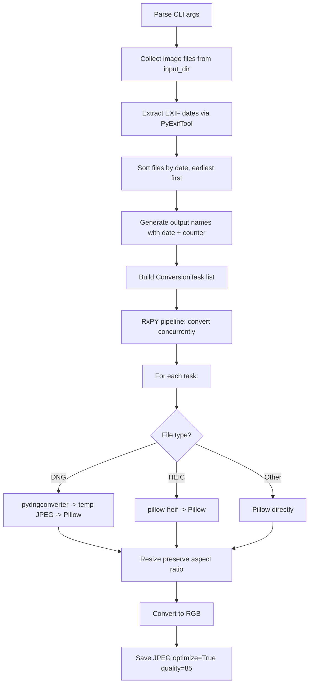

# Handover: Image Converter for Real Estate Listings

## Context

Need a new feature/command in `eir` that converts images (DNG, HEIC, JPG, PNG, TIFF, BMP, WebP) to optimized JPEG for real estate listing websites (Zillow, Apartments.com, Facebook). This leverages eir's existing `pydngconverter`, `PyExifTool`, and `reactivex` infrastructure.

## Target Platform Requirements (Researched)

| Platform       | Format          | Max Size | Dimensions                      |
| -------------- | --------------- | -------- | ------------------------------- |
| Zillow         | JPG/PNG/GIF/TIF | 50 MB    | Recommended 2048x1536           |
| Apartments.com | JPG/PNG         | -        | Min 2048px longest side         |
| Facebook       | JPEG/PNG        | 30 MB    | Recommended 1200px longest side |

**Defaults: 2048px longest side, JPEG quality 85** (satisfies all platforms)

## Existing eir Code to Reuse

| Component            | Location                       | Reuse                                                           |
| -------------------- | ------------------------------ | --------------------------------------------------------------- |
| EXIF date extraction | `src/eir/processor.py:98-104`  | `ExifToolHelper().get_tags()` with `EXIF:CreateDate`            |
| ExifTag enum         | `src/eir/processor.py:42-48`   | `ExifTag.CREATE_DATE`                                           |
| DNG conversion       | `src/eir/processor.py:106-327` | `pydngconverter.DNGConverter` pattern                           |
| DNGLab strategy      | `src/eir/dnglab_strategy.py`   | Platform-specific binary detection                              |
| Early DNG config     | `src/eir/cli.py`               | `PYDNG_DNG_CONVERTER` env var setup                             |
| RxPY pipeline        | `src/eir/processor.py`         | AsyncIOScheduler + observables                                  |
| Common utilities     | `src/eir/abk_common.py`        | `function_trace`, `PerformanceTimer`, `ensure_dir`              |
| Date parsing         | `src/eir/processor.py:485-502` | EXIF date format `"2024:12:10 14:30:05"` -> `"20241210-143005"` |
| File filtering       | `src/eir/processor.py:556`     | Exclude hidden files, thumbnails                                |
| Logger               | `src/eir/logger_manager.py`    | Singleton logger pattern                                        |

## What to Build

### Option A: New CLI subcommand in eir (Recommended)

Add a `convert` subcommand to eir's CLI. This keeps it integrated with eir's existing architecture.

```bash
eir convert -i ~/photos -o ~/listing_photos -q 85 -d 2048
```

### Option B: Standalone script in scripts/

If preferred, create `scripts/image_converter.py` as a standalone script that imports from `eir`.

### Supported Input Formats

```python
class ConvertFormat(StrEnum):
    DNG = ".dng"
    HEIC = ".heic"
    HEIF = ".heif"
    JPG = ".jpg"
    JPEG = ".jpeg"
    PNG = ".png"
    TIFF = ".tiff"
    TIF = ".tif"
    BMP = ".bmp"
    WEBP = ".webp"
```

### Dependencies to Add

```toml
# In pyproject.toml dependencies (most already exist in eir)
"pillow"       # Image processing, resize, JPEG save
"pillow-heif"  # HEIC/HEIF support (registers with Pillow)
```

`pillow` and `pillow-heif` are the only new deps needed. `pydngconverter`, `PyExifTool`, and `reactivex` are already eir dependencies.

### CLI Parameters

| Parameter         | Short | Default                | Description                          |
| ----------------- | ----- | ---------------------- | ------------------------------------ |
| `--input_dir`     | `-i`  | `~/Pictures`           | Input directory containing images    |
| `--output_dir`    | `-o`  | `~/Pictures/converted` | Output directory for converted JPEGs |
| `--quality`       | `-q`  | 85                     | JPEG quality 1-100                   |
| `--max_dimension` | `-d`  | 2048                   | Max pixel dimension (longest side)   |

### Output File Naming

Format: `<yyyymmdd>_<hhmmss>_<OutputDirName>_<NNN>.jpg`

- Date/time from EXIF `CreateDate` (fallback to file modification time)
- OutputDirName = name of the output directory
- NNN = zero-padded counter (001, 002, 003...)
- Files ordered by EXIF date (earliest first)

Examples: `20240101_120000_MyHouse_001.jpg`, `20240101_143000_MyHouse_002.jpg`

### Key Functions to Implement

| Function                                                                          | Description                                                                                                                                                 |
| --------------------------------------------------------------------------------- | ----------------------------------------------------------------------------------------------------------------------------------------------------------- |
| `collect_convertible_files(input_dir: Path) -> list[Path]`                        | Scan top-level dir for `ConvertFormat` extensions.                                                                                                          |
| `extract_and_sort_by_date(files: list[Path]) -> list[tuple[Path, datetime]]`      | Extract EXIF dates, sort earliest first. Reuse `ExifToolHelper` pattern from processor.py.                                                                  |
| `generate_output_name(output_dir: Path, index: int, exif_date: datetime) -> Path` | Build output filename with date, dir name, counter.                                                                                                         |
| `open_any_image(file_path: Path) -> Image.Image`                                  | Open image dispatching by format. DNG: convert via pydngconverter to temp JPEG then open. HEIC: via pillow-heif registered opener. Others: Pillow directly. |
| `resize_preserve_aspect(img: Image.Image, max_dim: int) -> Image.Image`           | Resize longest side to max_dim with LANCZOS. No-op if already smaller.                                                                                      |
| `convert_single(task: ConversionTask) -> ConversionResult`                        | Open -> resize -> RGB -> save JPEG (optimize=True, quality).                                                                                                |
| `convert_all(tasks: list[ConversionTask]) -> None`                                | RxPY reactive pipeline for concurrent processing.                                                                                                           |

### DNG Handling Pattern

```python
# Following existing eir pattern in processor.py
from pydngconverter import DNGConverter

# Convert DNG to JPEG in temp dir, then open with Pillow
with tempfile.TemporaryDirectory() as tmp:
    converter = DNGConverter(source=dng_path.parent, dest=Path(tmp))
    await converter.convert()
    jpeg_path = Path(tmp) / dng_path.with_suffix(".jpg").name
    img = Image.open(jpeg_path)
```

### EXIF Date Extraction Pattern

```python
# Reuse existing eir pattern
with exiftool.ExifToolHelper() as etp:
    metadata = etp.get_tags([str(f) for f in files], ["EXIF:CreateDate"])

# Parse "2024:12:10 14:30:05" format
for meta in metadata:
    date_str = meta.get("EXIF:CreateDate", "")
    if date_str:
        dt = datetime.strptime(date_str, "%Y:%m:%d %H:%M:%S")
    else:
        dt = datetime.fromtimestamp(Path(meta["SourceFile"]).stat().st_mtime)
```

### RxPY Pipeline Pattern

Follow eir's existing async RxPY pattern from processor.py:
- Use `AsyncIOScheduler` (eir uses async, not threads like bwp)
- `flat_map` for concurrent processing
- `retry(2)` for transient failures
- Progress tracking with counter

### Processing Flow



## Implementation Order (TDD)

1. Create `docs/todo/todo_list.md` with checklist
2. Add `pillow` and `pillow-heif` to `pyproject.toml`, run `uv sync`
3. Implement and test `collect_convertible_files()`
4. Implement and test `extract_and_sort_by_date()`
5. Implement and test `generate_output_name()`
6. Implement and test `open_any_image()` (mock pydngconverter/pillow-heif)
7. Implement and test `resize_preserve_aspect()`
8. Implement and test `convert_single()`
9. Implement and test `convert_all()` RxPY pipeline
10. Wire up CLI subcommand or standalone script
11. Ruff lint and format

## Testing

- Framework: pytest (eir's standard)
- Test file: `tests/test_image_converter.py`
- Mock external libs (exiftool, pydngconverter, Pillow I/O) for unit tests
- Use `tmp_path` pytest fixture for file system tests
- Use `@pytest.mark.parametrize` for resize dimension scenarios

## Verification

1. `uv run pytest tests/test_image_converter.py -v`
2. `uv run ruff check src/eir/ tests/`
3. Manual test with sample JPG, HEIC, DNG files
4. Verify output naming: `yyyymmdd_hhmmss_DirName_NNN.jpg`
5. Verify files ordered by EXIF date
6. Verify output dimensions <= 2048px longest side
